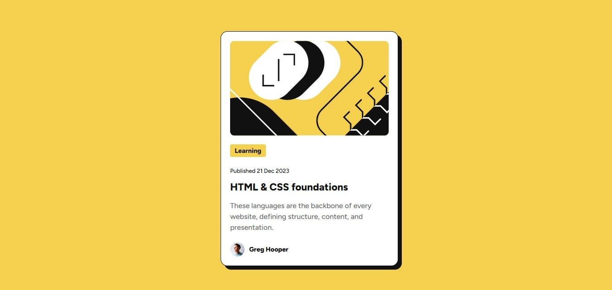

# CodeTribe BootCamp - Blog preview card solution


This is the repo for the final CodeTribe BootCamp assessment. It contains the code to the solution of the [Blog preview card challenge on Frontend Mentor](https://www.frontendmentor.io/challenges/blog-preview-card-ckPaj01IcS). 

## Table of contents

- [Overview](#overview)
  - [The assessment](#the-assessment)
  - [Screenshot](#screenshot)
  - [Links](#links)
- [My process](#my-process)
  - [Built with](#built-with)
  - [What I learned](#what-i-learned)
  - [Continued development](#continued-development)
  - [Useful resources](#useful-resources)
- [Author](#author)
- [Acknowledgments](#acknowledgments)

## Overview

### The assessment

The assessment is to build out this blog preview card and get it looking as close to the design as possible.

Users should be able to:
- See a blog card about the fundementals of HTML and CSS. 
- See hover and focus states for all interactive elements on the page. 

### Screenshot

 


### Links

- Live Site URL: [Site URL](https://your-live-site-url.com)

## My process

### Built with

- Semantic HTML5 markup
- Basic CSS properties
- Local Font Files (@font-face)
- Basic Mobile Responsiveness (Media Query)

### What I learned

This project was a good way to practice using CSS styling and  HTML structure. I worked on setting up the page's HTML structure and CSS styling.

- Using styles such as borders, margins, padding, fonts, and background colours.
- The card is centered on the page using Flexbox.
- Using `@font-face` to link local font files.
- Hover states are being implemented for interactive elements.
- A basic media query has been added for basic mobile adjustments.

```css
/* Example: Basic hover state */
.card-title:hover,
.card-title:active {
    color: hsl(47, 88%, 63%); /* Yellow on hover/active */
}

/* Example: Media Query */
@media (max-width: 400px) {
    .card {
        margin: 15px;
        padding: 15px;
        max-width: calc(100% - 30px);
    }
}
```

### Continued development

I plan to continue practicing HTML & CSS development, particularly focusing on:
- More advanced layout techniques.
- Adding more content to the site. 
- Creating more complex and robust responsive designs.
- Understanding CSS specificity and best practices better.


### Useful resources

- [Frontend Mentor](https://www.frontendmentor.io) - The platform for the challenge itself. Provided designs and assets.
- [MDN Web Docs](https://developer.mozilla.org/) - Always a great reference for HTML and CSS properties.

## Author

- Website - [Sihle Kekana](https://github.com/SKekana)

## Acknowledgments

- Thanks to mLab for providing this BootCamp.
